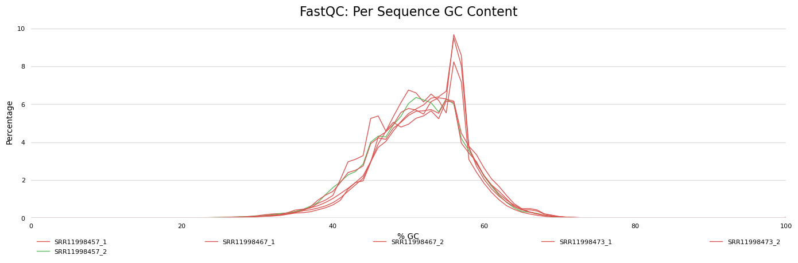
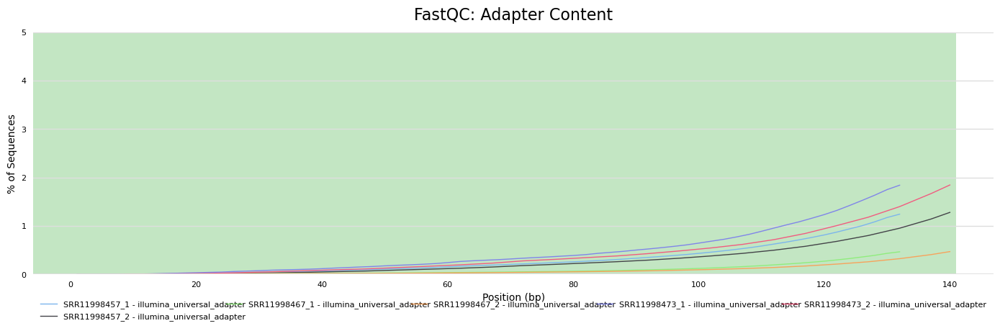
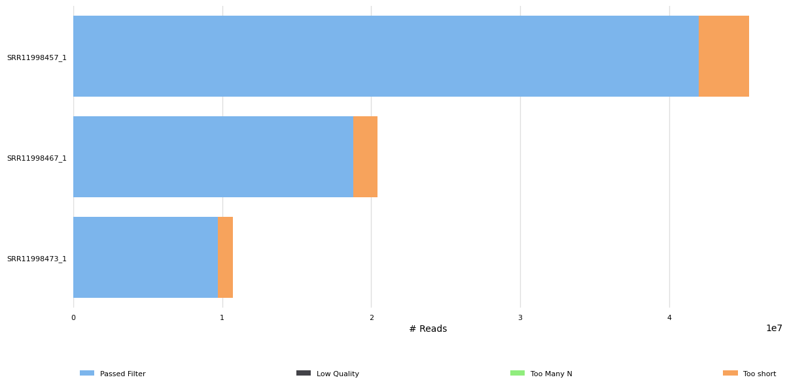

# Group Project: RNA-Seq Workflow (Microbial)

## Preparation
- **GitHub Setup**
  - Team members: Brianna Spishock (QC), Youngju Jeon (Annotation), Brendan O'Brien (Alignment)

## Data Retrieval
- **NCBI SRA accessions used:**
  - SRR11998473 -starvation
  - SRR11998467 -oxidative
  - SRR11998457 -acidic

Bioproject PRJNA638918 "RNA Atlas of Bacterial Human Pathogens Uncovers Stress Dynamics"

## Download Salmonella RNA-seq Data

```bash
# Navigate to analysis directory
cd ~/groupproject

# install sratool-toolkit to use prefetch and other tools
sudo apt install sra-toolkit

# Acidic stress 
mkdir -p acidic
prefetch SRR11998457
fasterq-dump SRR11998457 --split-files --threads 8 --outdir acidic

# Oxidative stress
mkdir -p oxidative
prefetch SRR11998467
fasterq-dump SRR11998467 --split-files --threads 8 --outdir oxidative

# Starvation stress
mkdir -p starvation
prefetch SRR11998473
fasterq-dump SRR11998473 --split-files --threads 8 --outdir starvation
```


## Quality Control (QC)
- **Tools Used:** 
  - FastQC
  - MultiQC
 
```bash
# Create an output folder for FastQC reports
mkdir -p qc_reports

# Run FastQC on all FASTQ files inside each condition folder
fastqc acidic/*.fastq -o qc_reports
fastqc oxidative/*.fastq -o qc_reports
fastqc starvation/*.fastq -o qc_reports
```

```bash
#install multiqc
sudo apt install multiqc
# Put all reports together using MultiQC
cd qc_reports
multiqc .
# Generate QC plots 
multiqc . --export
```

- **Tasks Performed:**  
  - Ran FastQC on all paired-end FASTQ files across three conditions (acidic, oxidative, starvation)
  - Generated per-sample QC reports (`*_fastqc.html`) with metrics for sequence quality, GC content, duplication, and adapter contamination  
  - Ran MultiQC to put all FastQC results into a single summary report (`multiqc_report.html`)  

- **Deliverables:**
### 2 QC plots raw data
Plot 1 : GC Content (Raw) - GC distribution or raw reads is ~50-51% indicates no GC bias in raw reads.



Plot 2 : Adapter Content (Raw) - Adapter contamination detected in raw reads prior to trimming.




### Raw Read Counts and Duplication Rates (from multiqc_general_stats.txt)

| Sample        | Condition   | Raw Reads | Duplication % | GC % | Avg Length (bp) |
|---------------|-------------|-----------|--------------|------|------------------|
| SRR11998457_1 | Acidic      | 22.7 M    | 89.3%         | 50%  | 143             |
| SRR11998457_2 | Acidic      | 22.7 M    | 90.7%         | 50%  | 151             |
| SRR11998467_1 | Oxidative   | 10.2 M    | 87.5%         | 51%  | 143             |
| SRR11998467_2 | Oxidative   | 10.2 M    | 88.4%         | 51%  | 151             | 
| SRR11998473_1 | Starvation  | 5.4 M     | 88.1%         | 51%  | 143             | 
| SRR11998473_2 | Starvation  | 5.4 M     | 88.4%         | 50%  | 151             | 

- **Interpretation:**  
  - Read counts: Range from 22.7M in acidic to 5.4M in starvation. This reflects sequencing depth across different conditions.
  - Duplication: 87.5-90.7%
  - GC content: Stable at 50-51%
  - Read length: forward reads are 143bp and reverse reads are 151bp, consistent with expected paired-end design.

## Read Cleaning
- Tools Used:
  - Fastp
  - MultiQC

 ```bash
# install fastp
sudo apt install fastp

# make directory for reports
cd ~/groupproject
mkdir trimmed
mkdir qc_reports_trimmed

#Acidic
fastp \
  -i acidic/SRR11998457_1.fastq \
  -I acidic/SRR11998457_2.fastq \
  -o trimmed/SRR11998457_1.clean.fastq.gz \
  -O trimmed/SRR11998457_2.clean.fastq.gz \
  --detect_adapter_for_pe \
  --disable_quality_filtering \
  --length_required 30 \
  --thread 8 \
  --html qc_reports_trimmed/SRR11998457_fastp.html \
  --json qc_reports_trimmed/SRR11998457_fastp.json 

#Oxidative
fastp \
  -i oxidative/SRR11998467_1.fastq \
  -I oxidative/SRR11998467_2.fastq \
  -o trimmed/SRR11998467_1.clean.fastq.gz \
  -O trimmed/SRR11998467_2.clean.fastq.gz \
  --detect_adapter_for_pe \
  --disable_quality_filtering \
  --length_required 30 \
  --thread 8 \
  --html qc_reports_trimmed/SRR11998467_fastp.html \
  --json qc_reports_trimmed/SRR11998467_fastp.json 

#Starvation
fastp \
  -i starvation/SRR11998473_1.fastq \
  -I starvation/SRR11998473_2.fastq \
  -o trimmed/SRR11998473_1.clean.fastq.gz \
  -O trimmed/SRR11998473_2.clean.fastq.gz \
  --detect_adapter_for_pe \
  --disable_quality_filtering \
  --length_required 30 \
  --thread 8 \
  --html qc_reports_trimmed/SRR11998473_fastp.html \
  --json qc_reports_trimmed/SRR11998473_fastp.json 


```

```bash

fastqc -t 8 trimmed/*.fastq.gz -o qc_reports_trimmed

cd qc_reports_trimmed
multiqc . -o multiqc_trimmed

```
- **Tasks Performed:** 
  - Ran `fastp` on all paired-end reads for each condition
  - Removed adapter sequences from raw reads. Quality filtering was disabled due to masked quality scores.
  - Generated per-sample trimming reports (`.html` and `.json`)    
  - Reran `fastqc` on the trimmed files
  - Ran `multiqc` on the trimmed files

- **Deliverables:**
### 1 QC plots for cleaned data
Plot 3 : Pre vs Post Trimming Read Counts - Horizontal bars show read counts for samples. The blue portion represents reads retained after trimming while the orange portion represents adapters or short reads that were discarded. The majority of the reads were retained confirming successful trimming.



### Cleaned Read Counts and Duplication Rates (from multiqc_general_stats.txt)
| Sample        | fastp Dup % | fastp Q30 Rate | fastp Q30 Bases | fastp GC % | % Surviving | % Adapters | FastQC Dup % | FastQC GC % | Avg Length (bp) | Total Reads |
|---------------|-------------|----------------|-----------------|------------|-------------|------------|--------------|-------------|-----------------|-------------|
| SRR11998457_1 | 66.3%       | 0.0            | 0.0             | 50.5%      | 92.6%       | 7.9%       | 88.4%        | 50.0%       | 141.2           | 21.0 M      |
| SRR11998457_2 | —           | —              | —               | —          | —           | —          | 89.9%        | 50.0%       | 149.9           | 21.0 M      |
| SRR11998467_1 | 66.7%       | 0.0            | 0.0             | 51.2%      | 92.0%       | 6.3%       | 86.4%        | 51.0%       | 141.8           | 9.4 M       |
| SRR11998467_2 | —           | —              | —               | —          | —           | —          | 87.5%        | 50.0%       | 150.7           | 9.4 M       |
| SRR11998473_1 | 67.8%       | 0.0            | 0.0             | 50.9%      | 90.6%       | 9.8%       | 86.9%        | 51.0%       | 141.2           | 4.8 M       |
| SRR11998473_2 | —           | —              | —               | —          | —           | —          | 87.4%        | 50.0%       | 149.8           | 4.8 M       |

### Raw vs. cleaned read counts.
| Sample        | Condition   | Raw Reads | Cleaned Reads | % Surviving |
|---------------|-------------|-----------|---------------|-------------|
| SRR11998457   | Acidic      | 22.7 M    | 21.0 M        | 92.6%       |
| SRR11998467   | Oxidative   | 10.2 M    | 9.4 M         | 92.0%       |
| SRR11998473   | Starvation  | 5.4 M     | 4.8 M         | 90.6%       |


- **Interpretation:**  
  - Read counts: Read count less than raw reads (22.7M -> 21.0M, 10.2M -> 9.4M, 5.4M -> 4.8M). ~90% of sequences were passed through cleaning. Low quality bases were not trimmed due to hidden scores. This drop is due to adapter removal and fixed trimming.
  - Duplication: 66-68% in fastp, 86-90% in fastqc. Still remains high but consistent with RNA-seq.
  - GC content: Still stable at 50-51%. Trimming did not change base composition. 
  - Read length: Varied between 141-151bp due to adapter trimming clipping reads to different lengths.

## Download Salmonella Reference Genome

- **Tasks Performed:** 
  - Confirmed SRR11998457, SRR11998467, and SRR11998473 in BioProject PRJNA638918 are from Salmonella enterica Typhimurium
  - Found reference genome for Salmonella enterica serovar Typhimurium LT2 (GCF_000006945.2 (ASM694v2))
  - Downloaded genome FASTA (.fna), CDS FASTA(cds_from_genomic.fna) and annotation file (.gff)
  - Renamed files to styphimurium.fna, styphimurium.gff and styphimurium_cds_from_genomic.fna then moved into a reference directory

```bash
wget https://ftp.ncbi.nlm.nih.gov/genomes/all/GCF/000/006/945/GCF_000006945.2_ASM694v2/GCF_000006945.2_ASM694v2_genomic.fna.gz
wget https://ftp.ncbi.nlm.nih.gov/genomes/all/GCF/000/006/945/GCF_000006945.2_ASM694v2/GCF_000006945.2_ASM694v2_genomic.gff.gz
wget https://ftp.ncbi.nlm.nih.gov/genomes/all/GCF/000/006/945/GCF_000006945.2_ASM694v2/GCF_000006945.2_ASM694v2_cds_from_genomic.fna.gz
gunzip *.gz

mv GCF_000006945.2_ASM694v2_genomic.fna styphimurium.fna
mv GCF_000006945.2_ASM694v2_genomic.gff styphimurium.gff
mv GCF_000006945.2_ASM694v2_cds_from_genomic.fna styphimurium_cds_from_genomic.fna

mkdir reference

mv styphimurium.* reference/

```

## Alignment
- Tools Used:
  - HISAT2
  - Samtools
  - Samtools flagstat for alignment data
  - subread (featureCounts) https://subread.sourceforge.net/featureCounts.html
```bash
#install packages
sudo apt install samtools
sudo apt install hisat2
sudo apt install subread

#change directory to ref genome
cd reference/

#create index files
hisat2-build styphimurium.fna styph_index

# go back to project folder
cd ../

#create alignment directory
mkdir -p alignment_bam

# perform alignments with Hisat2  using cleaned fastq (these may take a few minutes)
#acidic
hisat2 -p 8 -x reference/styph_index \
 -1 trimmed/SRR11998457_1.clean.fastq.gz \
 -2 trimmed/SRR11998457_2.clean.fastq.gz | \
 samtools view -b - | \
 samtools sort -o alignment_bam/acidic_sorted.bam

#oxidative
hisat2 -p 8 -x reference/styph_index \
 -1 trimmed/SRR11998467_1.clean.fastq.gz \
 -2 trimmed/SRR11998467_2.clean.fastq.gz | \
 samtools view -b - | \
 samtools sort -o alignment_bam/oxidative_sorted.bam

#starvation
hisat2 -p 8 -x reference/styph_index \
 -1 trimmed/SRR11998473_1.clean.fastq.gz \
 -2 trimmed/SRR11998473_2.clean.fastq.gz | \
 samtools view -b - | \
 samtools sort -o alignment_bam/starvation_sorted.bam


# index the acidic sample
samtools index alignment_bam/acidic_sorted.bam

# Index the oxidative sample
samtools index alignment_bam/oxidative_sorted.bam

# Index the starvation sample
samtools index alignment_bam/starvation_sorted.bam

#alignment statistics
 mkdir -p alignment_stats

# Acidic sample
samtools flagstat alignment_bam/acidic_sorted.bam > alignment_stats/acidic_stats.txt

# Oxidative sample
samtools flagstat alignment_bam/oxidative_sorted.bam > alignment_stats/oxidative_stats.txt

# Starvation sample
samtools flagstat alignment_bam/starvation_sorted.bam > alignment_stats/starvation_stats.txt

# --- subread for feature counts ---

# Create a directory for the count results
mkdir -p feature_counts

# Run featureCounts
featureCounts -p \
              -F GFF \
              -t gene \
              -g locus_tag \
              -a reference/styphimurium.gff \
              -o feature_counts/all_samples_counts.txt \
              alignment_bam/acidic_sorted.bam \
              alignment_bam/oxidative_sorted.bam \
              alignment_bam/starvation_sorted.bam

```

- **Tasks Performed:** 
  - created index files from reference genome
  - created sam files from trimmed, cleaned fastq 
  - align, converted sam to bam
  - index bam files
  - used flagstat for alignment metrics  

- **Deliverables:**
- 1-2 tables with alignment metrics

  | Sample Name | Condition   | Total Reads  | Mapping % |
| :---------- | :---------- | :----------- | :--------   |
| SRR11998457 | Acidic      |  43363202    |  95.72%     |
| SRR11998467 | Oxidative   |  19077236    |  95.94%     |
| SRR11998473 | Starvation  |  9994445     |  95.74%      |

Status	acidic_sorted.bam	oxidative_sorted.bam	starvation_sorted.bam
Assigned	33,401,310	15,903,075	8,224,321
Unassigned_Ambiguity	4,742,490	1,633,075	647,189
Unassigned_MultiMapping	2,130,279	415,736	405,344
Unassigned_Unmapped	1,855,500	774,131	425,741
Unassigned_NoFeatures	1,233,623	351,219	291,850
Unassigned_Other	0	0	0
Total Reads	43,363,202	19,077,236	9,994,445
Percent Assigned to Gene	77.03%	83.36%	82.29%


## Annotation and Quantification
- Tools Used:
  - Salmon
    
- **Tasks Performed:**
  - **Annotation**
  - Extracted transcript and protein IDs from the CDS FASTA file (styph_cds.fna).
  - Parsed the GFF annotation file (styphimurium.gff) to retrieve corresponding protein_id, locus_tag, and product attributes.
  - Sorted and joined both mapping files to generate a comprehensive annotation table (tx2gene_product.tsv) linking each transcript to its gene and product information.
 
  - **Quantification**
  - Built a Salmon index from the CDS FASTA reference (styph_cds.fna) using a k-mer length of 31.
  - Quantified expression levels for three stress conditions
  - Used Salmon options --validateMappings, --gcBias, and --seqBias for accurate bias correction.
  - Generated per-condition quantification files (quant.sf) containing TPM and read count values.
  - Combined quantification results with annotation data to produce Top-10 expressed gene tables.


**Quantification:**

  -Setup + Folders
```bash
#install Salmon via conda
mamba create -n salmon-env -c bioconda -c conda-forge salmon pigz parallel -y
conda activate salmon-env
cd ~/groupproject
mkdir -p quant tables maps
```


  -Build Salmon index (from CDS)
```bash
salmon index \
  -t reference/styph_cds.fna \
  -i reference/salmon_cds_index \
  --kmerLen 31
```

  -Quantify each condition with Salmon
```bash
#take the raw RNA-seq reads (*_1.fastq and *_2.fastq) from each folder and produces expression quantification results (TPM, counts, etc.) for each condition.
# Acidic
salmon quant -i reference/salmon_cds_index -l A \
  -1 trimmed/SRR11998457_1.clean.fastq.gz \
  -2 trimmed/SRR11998457_2.clean.fastq.gz \
  -p 8 --validateMappings --gcBias --seqBias \
  -o quant/acidic

# Oxidative
salmon quant -i reference/salmon_cds_index -l A \
  -1 trimmed/SRR11998467_1.clean.fastq.gz \
  -2 trimmed/SRR11998467_2.clean.fastq.gz \
  -p 8 --validateMappings --gcBias --seqBias \
  -o quant/oxidative

# Starvation
salmon quant -i reference/salmon_cds_index -l A \
  -1 trimmed/SRR11998473_1.clean.fastq.gz \
  -2 trimmed/SRR11998473_2.clean.fastq.gz \
  -p 8 --validateMappings --gcBias --seqBias \
  -o quant/starvation
```


**Annotation:**


  -Build a robust annotation map (CDS → protein_id → gene/product)
```bash
# FASTA→protein map
awk '
  /^>/ {
    tid=$1; sub(/^>/,"",tid);
    pid="";
    if (match($0, /protein_id=([^]]+)/, m)) { 
      pid=m[1];
    }
    if (pid!="") print tid "\t" pid;
  }
' reference/styphimurium_cds_from_genomic.fna > maps/fastaid2protein.tsv

# GFF protein→gene/product map
awk -F'\t' '
$3=="CDS" {
  pid=""; ltag=""; prod="";
  split($9, a, ";");
  for (i in a) {
    split(a[i], kv, "=");
    if (kv[1]=="protein_id") pid=kv[2];
    else if (kv[1]=="locus_tag") ltag=kv[2];
    else if (kv[1]=="product")   prod=kv[2];
  }
  if (pid!="") print pid"\t"ltag"\t"prod;
}' reference/styphimurium.gff > maps/protein2gene_product.tsv

#Sort and join on protein_id
sort -k2,2 maps/fastaid2protein.tsv > maps/fastaid2protein.sorted.tsv   # key is col2
sort -k1,1 maps/protein2gene_product.tsv > maps/protein2gene_product.sorted.tsv  # key is col1

# Join on protein_id, then reorder to (transcript_id, gene, product)
join -t $'\t' -1 2 -2 1 maps/fastaid2protein.sorted.tsv maps/protein2gene_product.sorted.tsv \
| awk -v OFS='\t' '{tid=$2; gene=$3; prod=$4; print tid, gene, prod}' \
> maps/tx2gene_product.tsv
```

  -Top-10 tables
```bash
#Gene-level tables from Salmon quant.sf
#Acidic (Top 10 TPM)
awk -F'\t' 'NR==FNR{m[$1]=$2"\t"$3; next} FNR>1{print $4"\t"m[$1]"\t"$1"\t"$5}' \
  maps/tx2gene_product.tsv \
  quant/acidic/quant.sf \
| sort -nrk1 \
| head -10 \
| awk 'BEGIN{OFS="\t"; print "TPM","Gene","Product","CDS_ID","NumReads"} {print}' \
> tables/top10_acidic.tsv

#Oxidative (Top 10 TPM)
awk -F'\t' 'NR==FNR{m[$1]=$2"\t"$3; next} FNR>1{print $4"\t"m[$1]"\t"$1"\t"$5}' \
  maps/tx2gene_product.tsv \
  quant/oxidative/quant.sf \
| sort -nrk1 | head -10 \
| awk 'BEGIN{OFS="\t"; print "TPM","Gene","Product","CDS_ID","NumReads"} {print}' \
> tables/top10_oxidative.tsv

#Starvation (Top 10 TPM)
awk -F'\t' 'NR==FNR{m[$1]=$2"\t"$3; next} FNR>1{print $4"\t"m[$1]"\t"$1"\t"$5}' \
  maps/tx2gene_product.tsv \
  quant/starvation/quant.sf \
| sort -nrk1 | head -10 \
| awk 'BEGIN{OFS="\t"; print "TPM","Gene","Product","CDS_ID","NumReads"} {print}' \
> tables/top10_starvation.tsv

```

  -Each
  
tables/top10_acidic.tsv

tables/top10_oxidative.tsv

tables/top10_starvation.tsv

 

- **Deliverables:**
  - Top 10 expressed genes table
### **Top 10 Expressed Genes — Acidic Condition**

| **TPM** | **Gene** | **Product** | **CDS_ID** | **NumReads** |
|---------:|-----------|--------------|-------------|--------------:|
| 38342.901142 | STM1335 | 50S | lcl\|NC_003197.2_cds_NP_460301.1_1296 | 48449.603 |
| 33301.169196 | STM1191 | 50S | lcl\|NC_003197.2_cds_NP_460161.1_1156 | 34823.946 |
| 27037.638246 | STM4002 | putative | lcl\|NC_003197.2_cds_NP_462882.1_3878 | 42411.000 |
| 25393.549091 | STM3728 | 50S | lcl\|NC_003197.2_cds_NP_462628.1_3623 | 44257.885 |
| 24779.281014 | STM3304 | 50S | lcl\|NC_003197.2_cds_NP_462214.1_3209 | 80976.168 |
| 22968.309500 | STM1196 | acyl | lcl\|NC_003197.2_cds_NP_460166.1_1161 | 40031.127 |
| 20503.823884 | STM3033 | 50S | lcl\|NC_003197.2_cds_NP_462213.1_3208 | 42882.832 |
| 19337.171510 | STM1377 | murein | lcl\|NC_003197.2_cds_NP_460342.1_1337 | 33702.351 |
| 18379.472738 | STM3136 | 50S | lcl\|NC_003197.2_cds_NP_462032.1_1297 | 83286.315 |
| 15873.427223 | STM3432 | 50S | lcl\|NC_003197.2_cds_NP_462336.1_3331 | 18674.188 |

---

### **Top 10 Expressed Genes — Oxidative Condition**

| **TPM** | **Gene** | **Product** | **CDS_ID** | **NumReads** |
|---------:|-----------|--------------|-------------|--------------:|
| 41591.510650 | STM1377 | murein | lcl\|NC_003197.2_cds_NP_460342.1_1337 | 26232.000 |
| 36279.152475 | STM3432 | 50S | lcl\|NC_003197.2_cds_NP_462336.1_3331 | 15254.311 |
| 35218.546650 | STM2665 | ribosome | lcl\|NC_003197.2_cds_NP_461595.1_2590 | 56541.000 |
| 32558.201412 | STM1191 | 50S | lcl\|NC_003197.2_cds_NP_460161.1_1156 | 12445.237 |
| 25018.769534 | STM3429 | chaperone | lcl\|NC_003197.2_cds_NP_462319.1_4189 | 27255.463 |
| 22272.802930 | STM4170 | DNA-binding | lcl\|NC_003197.2_cds_NP_463093.1_4035 | 19581.478 |
| 20212.472123 | STM0831 | stress | lcl\|NC_003197.2_cds_NP_459808.1_803 | 86919.000 |
| 18888.130876 | STM1335 | 50S | lcl\|NC_003197.2_cds_NP_460301.1_1296 | 8302.896 |
| 15320.111492 | STM3870 | membrane-bound | lcl\|NC_003197.2_cds_NP_462769.1_3765 | 9955.283 |
| 15120.791518 | STM0608 | alkyl | lcl\|NC_003197.2_cds_NP_459600.1_595 | 84244.000 |

---

### **Top 10 Expressed Genes — Starvation Condition**

| **TPM** | **Gene** | **Product** | **CDS_ID** | **NumReads** |
|---------:|-----------|--------------|-------------|--------------:|
| 65031.124545 | STM2665 | ribosome | lcl\|NC_003197.2_cds_NP_461595.1_2590 | 50524.000 |
| 52769.402075 | STM1377 | murein | lcl\|NC_003197.2_cds_NP_460342.1_1337 | 17219.000 |
| 36165.782796 | STM4002 | putative | lcl\|NC_003197.2_cds_NP_462882.1_3878 | 11446.000 |
| 34326.514490 | STM4406 | putative | lcl\|NC_003197.2_cds_NP_463267.3_4263 | 15468.000 |
| 15647.422031 | STM2771 | filament | lcl\|NC_003197.2_cds_NP_461698.1_2693 | 144963.686 |
| 14828.141851 | STM0238 | putative | lcl\|NC_003197.2_cds_NP_459243.1_238 | 4147.302 |
| 13705.561029 | STM3238 | putative | lcl\|NC_003197.2_cds_NP_462142.1_3173 | 13223.851 |
| 13531.540520 | STM4088 | putative | lcl\|NC_003197.2_cds_NP_462969.1_3965 | 4619.000 |
| 13410.170520 | STM1751 | DNA-binding | lcl\|NC_003197.2_cds_NP_460710.1_1705 | 16774.000 |
| 12823.920169 | STM3444 | regulatory | lcl\|NC_003197.2_cds_NP_462348.1_3343 | 2889.317 |

